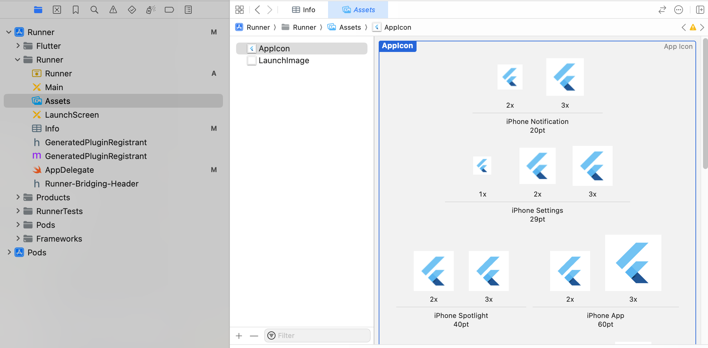

# Flutter - App Icon 的設置方式

## Android
> Icon 位於 **android** 資料夾裡的 **mipmap-?dpi** 資料夾(包含各種螢幕的分辨率)

路徑: **android/app/src/main/res**

## iOS
> Icon 位於 **Assets.xcassets** 資料夾裡的 **AppIcon.appiconset** 資料夾(包含各種尺寸)

路徑: **ios\Runner\Assets.xcassets\AppIcon.appiconset**

### 使用 xcode

**Runner** > **Assets** > **AppIcon**
依照不同尺寸的 icon 替換

## Reference
- [IconKitchen](https://icon.kitchen/)
- [UI設計師要如何出 App icon 的圖給 iOS及Android系統呢？](https://joycehg.medium.com/ui%E8%A8%AD%E8%A8%88%E5%B8%AB%E8%A6%81%E5%A6%82%E4%BD%95%E5%87%BA-app-icon-%E7%9A%84%E5%9C%96%E7%B5%A6-ios%E5%8F%8Aandroid%E7%B3%BB%E7%B5%B1%E5%91%A2-2de8d607e4d8)