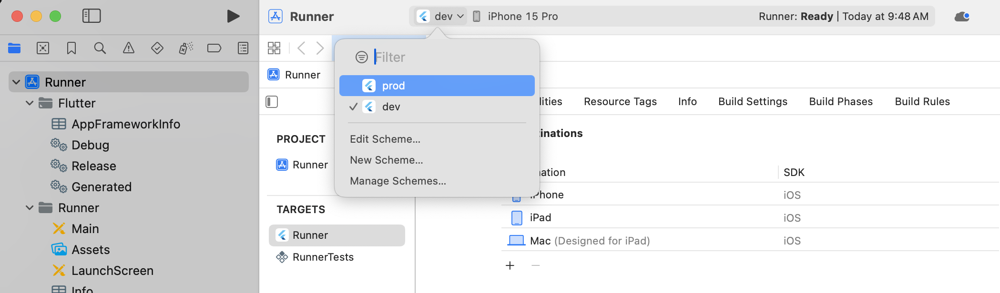
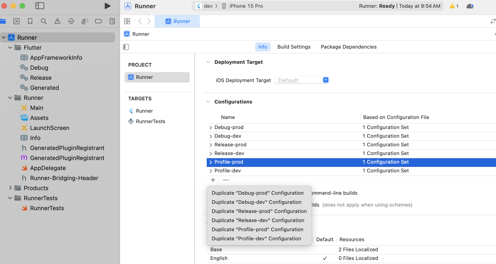
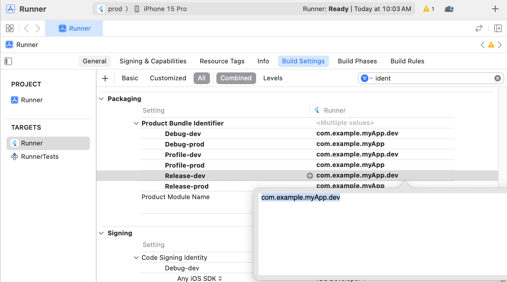
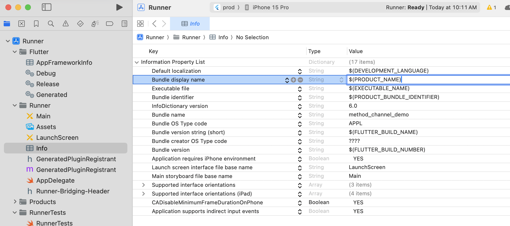

# Flutter flavors

> 可於 Flutter 切分不同的開發環境，如: dev(開發中)、stage(測試中)、production(正式發布)

## iOS
1. 以 ios 資料夾開啟 xcode
2. 從選單上 **Product** > **Scheme** > **Manage Scheme** 設定 scheme
    - 建立新的 dev scheme
    - 重新命名 Runner -> prod
    
3. 複製編譯設定以對應不同的 flavors
    - 複製每一項編譯設定，並重新命名並對應 flavors
    
4. 調整 scheme 對應變更後的編譯設定
    - **Product** > **Scheme** > **Manage Scheme** > **Select scheme** > **Edit**
    
5. 修改 app bundle identifier
    - 位於 **Build Settings** > **Product Bundle Identifier**
    - 修改名稱對應不同的 flavors
    
6. 修改 Product Name
    - 位於 **Build Settings**
    - 修改名稱對應不同的 flavors
    
7. 更新 **Bundle Display Name** 的值為變數名稱 `$(PRODUCT_NAME)`
    - 位於 **Info.plist**
    


## Android

1. 開啟專案內 **build.gradle** 檔案，路徑: **android/app/build.gradle**
2. 新增 `flavorDimensions`
    - `flavorDimensions` : Android 要求為每個 flavor 加上 Dimension 以分組
3. 新增 `productFlavors` object
    - `applicationIdSuffix` : 為 **ApplicationID** 尾端再加上一段文字，解決安裝衝突問題。
    ```gradle
    <!-- build.gradle -->

    android {
        <!-- ... -->
        flavorDimensions "default"
        productFlavors {
            dev {
              dimension "default"
              resValue "string", "app_name", "dev flavor example"
              applicationIdSuffix ".dev"
            }
            stage {
              dimension "default"
              resValue "string", "app_name", "stage flavor example"
              applicationIdSuffix ".stage"
            }
            production {
              dimension "default"
              resValue "string", "app_name", "prod flavor example"
            }
        }
    }
    ```

## Setting up launch configurations(VS code)

1. 專案根目錄建立 **.vscode** 資料夾
2. 建立 **launch.json** 於 **.vscode** 資料夾內
3. **launch.json** 設定如下
```json
{
  "version": "0.2.0",
  "configurations": [
    {
      "name": "dev",
      "request": "launch",
      "type": "dart",
      "program": "lib/main_dev.dart",
      "args": ["--flavor", "dev", "--target", "lib/main_dev.dart" ]
    },
    {
      "name": "prod",
      "request": "launch",
      "type": "dart",
      "program": "lib/main_prod.dart",
      "args": ["--flavor", "prod", "--target", "lib/main_prod.dart" ]
    }
  ],
  "compounds": []
}
```

## 修改專案進入點

1. 於 **lib** 資料夾內分別建立 **main_dev.dart** 與 **main_prod.dart**
    ```dart
    import 'package:./app.dart';

    void main() {
      runWithAppConfig();
    }
    ```
2. 原本的 **main.dart** 修改為 **app.dart**
    - 將 function `main` 修改為 `runWithAppConfig`
3. 於 **main_dev.dart** 與 **main_prod.dart** 內依照不同環境個別設定

## Reference

- [Create flavors of a Flutter app](https://docs.flutter.dev/deployment/flavors)
- [教你快速為 Flutter 設置 Flavor、App Icon 和 Launcher splash — Part 1: flutter_flavorizr](https://medium.com/flutter-formosa/%E6%95%99%E4%BD%A0%E5%BF%AB%E9%80%9F%E7%82%BA-flutter-%E8%A8%AD%E7%BD%AE-flavor-app-icon-%E5%92%8C-launcher-splash-part-1-flutter-flavorizr-ffdd617c35ca)
